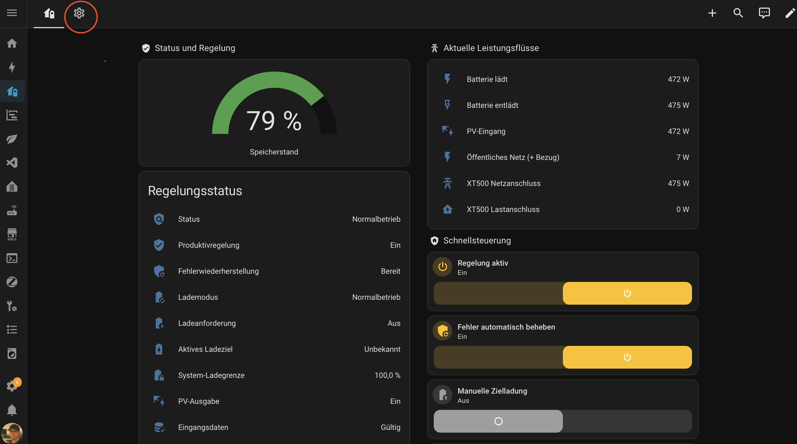

# XT500 Energy Manager

Home-Assistant-Integration zur produktiven Regelung von SunEnergyXT XT500 und
XT500 Pro. Sie übernimmt Nulleinspeisung, normales Laden, manuelle Zielladung,
manuelle und zeitgesteuerte Zyklusladung sowie die Begrenzung der
Wechselrichterleistung.

> [!NOTE]
> Dies ist ein unabhängiges Community-Projekt und keine offizielle
> SunEnergyXT-Integration. Der aktuelle Stand ist als öffentlicher Betatest
> gedacht. Rückmeldungen bitte über
> [GitHub Issues](https://github.com/achim1985/xt500-energy-manager/issues)
> melden.

> [!IMPORTANT]
> **Zuerst muss die originale Integration
> [SunEnergyXT 500 Series](https://github.com/SunEnergyXT/SunEnergyXT-500-Series)
> installiert und vollständig eingerichtet werden.** Der XT500 Energy Manager
> greift auf deren Sensoren und beschreibbare Sollwert-Entitäten zu und ersetzt
> sie nicht.

> [!WARNING]
> Diese Integration schreibt im Produktivbetrieb direkt auf die Sollwerte des
> Speichers. Automationen, Blueprints oder andere Regelungen, die dieselben
> Entitäten verändern, müssen vorher deaktiviert werden. Zwei gleichzeitig
> aktive Regler können sich gegenseitig überschreiben.

## Inhalt

- [Voraussetzungen](#voraussetzungen)
- [1. SunEnergyXT 500 Series installieren](#1-sunenergyxt-500-series-installieren)
- [2. XT500 Energy Manager installieren](#2-xt500-energy-manager-installieren)
- [3. Integration einrichten](#3-integration-einrichten)
- [4. Dashboard-Strategie einrichten](#4-dashboard-strategie-einrichten)
- [Bedienung und Lademodi](#bedienung-und-lademodi)
- [Sicherheitsverhalten](#sicherheitsverhalten)
- [Aktualisieren](#aktualisieren)
- [Fehlerbehebung](#fehlerbehebung)

## Voraussetzungen

- Home Assistant mit Zugriff auf das lokale Netz des XT500
- ein SunEnergyXT XT500 oder XT500 Pro
- die eingerichtete Originalintegration **SunEnergyXT 500 Series**
- ein Leistungssensor am öffentlichen Netzanschlusspunkt, zum Beispiel von
  einem Shelly Pro 3EM
- für die komfortable Dashboard-Erstellung über den Community-Dialog:
  Home Assistant 2026.5 oder neuer

Die Integration wurde mit Home Assistant 2026.7 und der SunEnergyXT-Integration
1.1.1 getestet.

## 1. SunEnergyXT 500 Series installieren

### Installation über HACS

1. In Home Assistant **HACS** öffnen.
2. Oben rechts das Drei-Punkte-Menü öffnen.
3. **Benutzerdefinierte Repositories** auswählen.
4. Als Repository eintragen:

   ```text
   https://github.com/SunEnergyXT/SunEnergyXT-500-Series
   ```

5. Als Typ **Integration** auswählen und das Repository hinzufügen.
6. In HACS nach **SunEnergyXT 500 Series** suchen.
7. Die Integration herunterladen.
8. Home Assistant neu starten.

### SunEnergyXT einrichten

1. **Einstellungen → Geräte & Dienste** öffnen.
2. **Integration hinzufügen** auswählen.
3. Nach **SunEnergyXT 500 Series** suchen.
4. Das automatisch erkannte Gerät bestätigen oder die IP-Adresse des XT500
   manuell eintragen.
5. Prüfen, ob anschließend mindestens folgende Entitäten vorhanden sind:

   - System-Speicherlevel (`SC`)
   - PV-Gesamteingangsleistung (`PV`)
   - Systemleistung am Netzanschluss (`GP`)
   - Systemleistung am Lastanschluss (`LP`)
   - Sollwert Leistung Netzanschluss (`GS`)
   - Sollwert maximale Wechselrichterleistung (`IS`)
   - System-Ladegrenze (`SA`)
   - Systemlastanschluss-Entladegrenze
   - Gesamteingangs- und Gesamtausgangsleistung des Systems

Erst wenn diese Entitäten verfügbar und nicht `unavailable` sind, mit dem
XT500 Energy Manager fortfahren.

## 2. XT500 Energy Manager installieren

### Installation über HACS (empfohlen)

1. In Home Assistant **HACS** öffnen.
2. Oben rechts das Drei-Punkte-Menü öffnen.
3. **Benutzerdefinierte Repositories** auswählen.
4. Als Repository eintragen:

   ```text
   https://github.com/achim1985/xt500-energy-manager
   ```

5. Als Typ **Integration** auswählen und das Repository hinzufügen.
6. In HACS nach **XT500 Energy Manager** suchen.
7. Die aktuelle Version herunterladen.
8. Home Assistant neu starten.
9. **Einstellungen → Geräte & Dienste → Integration hinzufügen** öffnen.
10. Nach **XT500 Energy Manager** suchen und die Integration auswählen.

### Manuelle Installation

1. Das aktuelle
   [GitHub-Release](https://github.com/achim1985/xt500-energy-manager/releases)
   öffnen.
2. Unter **Assets** den Quellcode als ZIP herunterladen.
3. Das ZIP-Archiv entpacken.
4. Den enthaltenen Ordner

   ```text
   custom_components/xt500_energy_manager
   ```

   in das Home-Assistant-Konfigurationsverzeichnis kopieren, sodass am Ende
   exakt diese Struktur vorhanden ist:

   ```text
   /config
   └── custom_components
       └── xt500_energy_manager
           ├── __init__.py
           ├── manifest.json
           ├── config_flow.py
           ├── frontend
           │   └── xt500-energy-dashboard-strategy.js
           └── ...
   ```

   Häufiger Fehler: Es darf kein zusätzlicher Ordner wie
   `xt500-energy-manager-main` zwischen `custom_components` und
   `xt500_energy_manager` liegen.

5. Home Assistant neu starten.
6. **Einstellungen → Geräte & Dienste → Integration hinzufügen** öffnen.
7. Nach **XT500 Energy Manager** suchen und die Integration auswählen.

## 3. Integration einrichten

Im Einrichtungsdialog werden die vorhandenen Home-Assistant-Entitäten
zugeordnet.

| Feld | Benötigte Entität |
| --- | --- |
| Speicherstand (SOC) | SunEnergyXT **System-Speicherlevel** (`SC`) |
| PV-Gesamteingangsleistung | SunEnergyXT **PV-Gesamteingangsleistung** (`PV`) |
| Leistung am öffentlichen Netzanschlusspunkt | Leistung des Hauszählers, zum Beispiel Gesamtwirkleistung eines Shelly Pro 3EM |
| XT500-Systemleistung am Netzanschluss | SunEnergyXT **Systemleistung am Netzanschluss** (`GP`) |
| XT500-Systemleistung am Lastanschluss | SunEnergyXT **Systemleistung am Lastanschluss** (`LP`) |
| Sollwert Leistung Netzanschluss | SunEnergyXT **Sollwert Leistung Netzanschluss** (`GS`) |
| Sollwert max. Wechselrichterleistung | SunEnergyXT **Sollwert max. Wechselrichterleistung** (`IS`) |
| System-Ladegrenze | SunEnergyXT **System-Ladegrenze** (`SA`) |
| Systemlastanschluss-Entladegrenze | SunEnergyXT **Systemlastanschluss-Entladegrenze**; wird im Dashboard direkt am Gerät eingestellt |
| Batterie-Ladeleistung | SunEnergyXT **Gesamteingangsleistung des Systems** |
| Batterie-Entladeleistung | SunEnergyXT **Gesamtausgangsleistung des Systems** |

Aus Gesamt-Eingang und Gesamt-Ausgang berechnet der Energiemanager zwei
gegenseitig ausschließende Nettowerte. Bei 200 W Eingang und 300 W Ausgang
zeigt das Dashboard daher `0 W` Laden und `100 W` tatsächliches Entladen.

### Öffentlichen Netzsensor richtig auswählen

Der öffentliche Netzsensor muss den Leistungsfluss des **gesamten Hauses am
Netzübergabepunkt** messen. Die PV-Leistung oder die XT500-Netzanschlussleistung
ist dafür nicht geeignet.

Anschließend die passende Vorzeichenrichtung auswählen:

- **Netzbezug ist positiv:** Der Sensor zeigt beim Strombezug zum Beispiel
  `+500 W` und bei Einspeisung `-500 W`.
- **Netzeinspeisung ist positiv:** Der Sensor zeigt bei Einspeisung
  `+500 W` und beim Strombezug `-500 W`.

Die Richtung vor dem Aktivieren der Regelung anhand eines aktuellen
Messwertes prüfen.

### Vor dem ersten Einschalten

1. Alte Nulleinspeisungs-Automationen oder Blueprints deaktivieren.
2. Prüfen, dass kein anderer Regler `GS`, `IS` oder `SA` beschreibt.
3. Für einen normalen XT500 das **Hausnetz-Limit** üblicherweise auf maximal
   `800 W` setzen.
4. Für einen XT500 Pro sind je nach Installation bis zu `2400 W` möglich.
5. Erst danach **Regelung aktiv** einschalten.

## 4. Dashboard-Strategie einrichten

Die Strategie erzeugt in der ausführlichen Standarddarstellung sechs Ansichten:

- **Speicher:** Status, Speicherstand, Leistungsflüsse und Schnellsteuerung
  für Regelung, manuelle Zielladung und Zyklusladung
- **Energie:** Energiefluss, Netzbilanz, Eigenverbrauch, Autarkie sowie
  Quellen- und Kostentabelle
- **Verlauf:** Hausverbrauch und PV-Erzeugung im gewählten Zeitraum
- **Verbraucher:** Energie-Sankey, größte Verbraucher und detaillierter
  Geräteverbrauch
- **Live:** aktueller Gesamtverbrauch, Akkustand, Leistung nach Quelle und
  momentaner Leistungsfluss als Sankey-Diagramm
- **Einstellungen:** Anleitung, manuelle Zielladung, Zyklusüberwachung,
  tägliche Prüfzeit, manueller Zyklusstart, Normalbetrieb und erweiterte
  Regelparameter

Die vier Energieseiten verwenden ausschließlich die in Home Assistant unter
**Energie** konfigurierten Quellen und Statistikdaten. Ihre Datumsauswahl und
der Vergleichszeitraum sind über die drei historischen Reiter synchron. Die
Live-Seite zeigt aktuelle Leistungsdaten unabhängig vom gewählten Zeitraum. Im Strategy-Editor
lassen sie sich alternativ zu einer kompakten Seite zusammenfassen oder
vollständig ausblenden.

### Einstellungsansicht nicht übersehen

Oben im automatisch erzeugten Dashboard gibt es mehrere Reiter. Das Haussymbol
öffnet die Speicherübersicht. Über das **Zahnradsymbol** ganz rechts wird die
vollständige Einstellungsansicht geöffnet. Je nach Bildschirmbreite werden
diese Reiter nur als Symbole angezeigt und können deshalb leicht übersehen
werden.



> [!TIP]
> Auf das markierte Zahnradsymbol klicken, um Ladeziele, Zyklusladung,
> Normalbetrieb und die erweiterten Regelparameter einzustellen.

Sie verwendet ausschließlich standardmäßig mit Home Assistant ausgelieferte
Karten.

Zusätzlich lassen sich über einen grafischen Strategy-Editor einzelne
Ansichten aus anderen, in Home Assistant gespeicherten Dashboards als echte
Reiter in die obere Leiste aufnehmen. Die Quellansicht bleibt dabei die
führende Konfiguration: Änderungen an ihr erscheinen nach einem vollständigen
Neuladen auch im Energiemanager-Dashboard.

### Schritt 1: JavaScript-Ressource registrieren

1. **Einstellungen → Dashboards** öffnen.
2. Oben rechts das Drei-Punkte-Menü öffnen.
3. **Ressourcen** auswählen.
4. **Ressource hinzufügen** auswählen.
5. Als URL exakt eintragen:

   ```text
   /xt500_energy_manager/xt500-energy-dashboard-strategy.js?v=1.5.0
   ```

6. Als Ressourcentyp **JavaScript-Modul** auswählen.
7. Speichern.
8. Im Drei-Punkte-Menü **Ressourcen neu laden** wählen. Falls dieser Eintrag
   nicht angeboten wird, Home Assistant im Browser vollständig neu laden.

### Schritt 2A: Dashboard über „Community-Dashboards“ erstellen

Dieser Weg steht ab Home Assistant 2026.5 zur Verfügung.

1. Wieder **Einstellungen → Dashboards** öffnen.
2. **Dashboard hinzufügen** auswählen.
3. Im Abschnitt **Community-Dashboards** auf
   **XT500 Energiemanager** klicken.
4. Die vorgeschlagenen Werte prüfen:

   - Titel: `XT500 Energiemanager`
   - Symbol: `mdi:home-battery`
   - URL: zum Beispiel `xt500-energiemanager`
   - In der Seitenleiste anzeigen: nach Wunsch aktivieren

5. Dashboard erstellen.
6. Das neue Dashboard öffnen. Die Ansichten **Speicher**, **Energie**,
   **Verlauf**, **Verbraucher**, **Live** und **Einstellungen** werden automatisch
   erzeugt.

### Schritt 2B: Manuelle Erstellung über die Rohkonfiguration

Dieser Weg funktioniert auch, wenn das Community-Dashboard nicht im
Auswahldialog erscheint.

1. **Einstellungen → Dashboards → Dashboard hinzufügen** öffnen.
2. Ein neues leeres Dashboard erstellen, zum Beispiel mit:

   - Titel: `XT500 Energiemanager`
   - Symbol: `mdi:home-battery`
   - URL: `xt500-energiemanager`

3. Das neue Dashboard öffnen.
4. Oben rechts auf den Stift **Dashboard bearbeiten** klicken.
5. Das Drei-Punkte-Menü öffnen.
6. **Rohkonfigurationseditor** auswählen.
7. Den gesamten vorhandenen Inhalt durch Folgendes ersetzen:

   ```yaml
   strategy:
     type: custom:xt500-energy-manager
   ```

8. Speichern und das Dashboard vollständig neu laden.

Die Karten und Ansichten dürfen bei einem Strategie-Dashboard nicht zusätzlich
manuell in die Rohkonfiguration kopiert werden. Sie werden bei jedem Öffnen aus
den vorhandenen XT500-Energy-Manager-Entitäten erzeugt.

### Blöcke anordnen und ausblenden

1. Unter **Einstellungen → Dashboards** beim
   **XT500 Energiemanager** die Dashboard-Einstellungen öffnen.
2. Im grafischen Strategy-Editor den Bereich
   **Aufbau der Energiemanager-Seiten** öffnen.
3. Für **Speicher** oder **Einstellungen**:

   - mit `↑` und `↓` einen Block verschieben
   - den Haken entfernen, um einen Block auszublenden
   - **Standard wiederherstellen** wählen, um alle Blöcke wieder einzublenden
     und die ursprüngliche Reihenfolge herzustellen

4. Speichern und das Dashboard vollständig neu laden.

Die Reihenfolge wird auf Smartphones von oben nach unten verwendet. Auf
breiten Bildschirmen verteilt Home Assistant dieselbe Reihenfolge automatisch
auf sein mehrspaltiges Raster. Speicherstand, Regelungsstatus, Sollwerte,
Zyklusladung, Leistungsflüsse und Schnellsteuerung bleiben dabei eigenständige
Blöcke.

### Energieseiten auswählen

1. Unter **Einstellungen → Dashboards** beim
   **XT500 Energiemanager** die Dashboard-Einstellungen öffnen.
2. Im Strategy-Editor unter **Energie-Dashboard** die gewünschte Darstellung
   wählen:

   - **Ausführlich – vier Reiter:** Energie, Verlauf, Verbraucher und Live
   - **Kompakt – ein Reiter:** die wichtigsten Karten auf einer Seite
   - **Nicht anzeigen:** keine zusätzlichen Energieseiten

3. Speichern und das Dashboard vollständig neu laden.

Die Datumsauswahl, frei gewählte Zeiträume und der Vergleich mit dem vorherigen
Zeitraum bleiben in der ausführlichen Darstellung über die drei historischen
Reiter synchron. **Live** zeigt den aktuellen Gesamtverbrauch, den Akkustand,
den Leistungsverlauf des Tages und den momentanen Leistungsfluss. Voraussetzung
sind unter **Energie** eingerichtete Netz-, PV-, Speicher- oder
Verbraucherquellen einschließlich der jeweiligen Leistungssensoren. Fehlende
Quellen erzeugt der Energiemanager nicht künstlich.

### Ansichten anderer Dashboards ergänzen

1. Das XT500-Energiemanager-Dashboard öffnen.
2. Oben rechts **Dashboard bearbeiten** auswählen.
3. Die Konfiguration der Dashboard-Strategie öffnen.
4. Unter **Zusätzliche Dashboard-Ansichten** auf
   **Ansicht hinzufügen** klicken.
5. Das Quell-Dashboard und anschließend die gewünschte Quell-Ansicht
   auswählen.
6. Optional einen kürzeren Titel und ein anderes `mdi:`-Symbol für den neuen
   Reiter eintragen.
7. Die Sichtbarkeit wählen:

   - **Für alle berechtigten Benutzer:** Vorhandene Benutzerbeschränkungen der
     Quellansicht bleiben unverändert erhalten.
   - **Nur für mich:** Die Ansicht wird zusätzlich auf das Benutzerkonto
     beschränkt, das diese Einstellung speichert.

8. Speichern und das Dashboard vollständig neu laden.

Die eingebundene Ansicht erscheint als normaler Reiter nach **Speicher** und vor
den automatisch erzeugten Energieseiten. **Einstellungen** bleibt dabei immer
der ganz rechte Reiter.
Es wird keine unabhängige Kopie angelegt. Dadurch bleiben spätere Änderungen an
der ursprünglichen Ansicht wirksam.

> [!NOTE]
> Einbindbar sind einzelne, fest konfigurierte Ansichten aus Dashboards im
> Speichermodus. Ein anderes XT500-Energiemanager-Strategie-Dashboard oder eine
> Ansicht mit eigener dynamischer Strategie wird zum Schutz vor verschachtelten
> Strategien nicht angeboten.

## Bedienung und Lademodi

### Normalbetrieb

Der Speicher gleicht den Hausverbrauch aus und hält das eingestellte Netzziel
ein. Das **Ladelimit im Normalbetrieb** wird als reale System-Ladegrenze auf
den XT500 geschrieben.

### PV-Überschuss

Aktuelle PV-Leistung wird nur passend zum Hausverbrauch freigegeben. Nicht
benötigte PV-Leistung kann im Akku bleiben. Eine absichtliche Netzladung wird
nicht angefordert.

### PV-Vorrang

Das Ladeziel wird ausschließlich mit PV verfolgt. Die Batterieentladung wird
währenddessen zurückgehalten. Bei schlechten PV-Tagen bleibt die Anforderung
über mehrere Tage aktiv, bis das Ziel erreicht ist.

### Netzladung

Der Speicher darf mit der eingestellten AC-Ladeleistung aus dem Netz laden.
Damit kann das Ziel auch nachts oder bei schlechtem Wetter erreicht werden.

### PV + Netz

Vorhandene PV-Leistung wird genutzt und zusätzlich ist Netzladung mit der
eingestellten AC-Leistung erlaubt.

### Zyklusladung

Die Zyklusladung verwendet ihren eigenen **Lademodus** und ihr eigenes
**Vollladeziel**:

- **Automatische Zyklusüberwachung** zählt die Tage seit dem letzten erreichten
  Vollladeziel beziehungsweise seit dem letzten manuellen Zurücksetzen. Der
  eingeschaltete Schalter bedeutet nur, dass überwacht wird – noch nicht, dass
  gerade geladen wird.
- Ist das Intervall abgelaufen, lautet der Zyklusstatus
  **Fällig – wartet auf tägliche Prüfzeit**. Erst zur eingestellten
  **täglichen Prüfzeit** wird die Zyklusladung im ausgewählten Modus gestartet.
- **Zyklusladung jetzt manuell starten** startet sofort, auch wenn das
  Intervall noch nicht abgelaufen ist. Die automatische Überwachung wird
  dadurch nicht umgeschaltet.
- **Zyklustage auf 0 zurücksetzen** beginnt das Intervall ab diesem Zeitpunkt
  neu und beendet eine gegebenenfalls laufende Zyklusladung. Der Reset wird
  nicht als künstlich erreichte Vollladung gespeichert.

Der separate **Zyklusstatus** unterscheidet:

- automatische Überwachung aus
- automatische Überwachung aktiv
- Zyklus fällig und auf Prüfzeit wartend
- manuell gestartete Zyklusladung aktiv
- automatisch gestartete Zyklusladung aktiv
- Zyklusladung angehalten, beispielsweise bei ausgeschalteter Regelung oder
  ungültigen Eingangsdaten

### Verhalten bei erreichtem Ziel

- Die manuelle Zielladung wird beendet.
- Eine manuell oder automatisch gestartete Zyklusladung wird beendet.
- Beim Erreichen des Vollladeziels wird der Zeitpunkt gespeichert und das
  Zyklusintervall beginnt neu. Das gilt auch, wenn der Speicher dieses Ziel im
  Normalbetrieb allein durch PV erreicht.
- Die System-Ladegrenze kehrt zum **Ladelimit im Normalbetrieb** zurück.
- Anschließend arbeitet wieder der gewählte Grundmodus.

## Sicherheitsverhalten

- Nach einem Home-Assistant-Start wartet die Integration, bis Home Assistant
  vollständig läuft und alle Eingangsdaten mindestens fünf Sekunden gültig
  waren.
- Kurzzeitig ungültige Eingangsdaten oder nicht lesbare XT500-Sollwerte starten
  zunächst nur eine Kommunikationspause. Die Regelung fährt automatisch fort,
  sobald alle Werte und frischen Messrückmeldungen 15 Sekunden stabil sind.
- Bleibt die Kommunikation 90 Sekunden instabil oder schlagen drei
  Schreibversuche trotz weiterhin lesbarer Sollwerte fehl, wird die Regelung
  verriegelt. Ist die
  automatische Fehlerwiederherstellung aktiv, wartet sie zunächst auf stabile
  neue Rückmeldungen, prüft die Verbindung mit einem wirkungslosen Schreibtest
  auf den bereits vorhandenen Wechselrichter-Sollwert und gibt erst nach
  weiteren Messrückmeldungen wieder frei.
- Es gibt höchstens drei automatische Versuche mit wachsender Wartezeit.
  Danach bleibt die Regelung verriegelt, bis der Hauptschalter aus- und wieder
  eingeschaltet wird.
- Kleine, mittlere und große Regelabweichungen verwenden unterschiedliche
  Zeitabstände und maximale Sollwertänderungen.
- Nach jedem Schreibvorgang wartet die Integration auf neue Messwerte.
- Bei sehr geringer PV-Leistung setzt die Niedrig-PV-Sperre die Ausgabe auf
  `0 W` und gibt sie erst nach der eingestellten Startleistung und Wartezeit
  wieder frei.

## Aktualisieren

### Aktualisierung über HACS

1. **Regelung aktiv** ausschalten.
2. Das von HACS angebotene Update installieren.
3. Home Assistant neu starten.
4. Die Versionsnummer der Dashboard-Ressource auf die neue Version ändern.
5. **Ressourcen neu laden** oder den Browser vollständig neu laden.
6. Dashboard, Eingangsdaten und Produktivregelung prüfen.
7. Regelung wieder aktivieren.

### Manuelle Aktualisierung

1. **Regelung aktiv** ausschalten.
2. Das neue GitHub-Release als ZIP herunterladen.
3. Den vorhandenen Ordner
   `/config/custom_components/xt500_energy_manager` durch den neuen ersetzen.
4. Die Versionsnummer der Dashboard-Ressource an die neue Version anpassen.
5. Home Assistant neu starten.
6. Dashboard und Eingangsdaten prüfen.
7. Regelung wieder aktivieren.

## Fehlerbehebung

### „XT500 Energy Manager“ erscheint nicht bei den Integrationen

- Verzeichnisstruktur prüfen.
- Sicherstellen, dass `manifest.json` direkt unter
  `/config/custom_components/xt500_energy_manager/` liegt.
- Home Assistant neu starten.
- Unter **Einstellungen → System → Protokolle** nach
  `xt500_energy_manager` suchen.

### Dashboard meldet „Timeout waiting for strategy element“

- Prüfen, ob die Ressource als **JavaScript-Modul** eingetragen ist.
- URL und Versionsnummer prüfen.
- **Ressourcen neu laden** oder einen vollständigen Browser-Neustart
  durchführen.

### Dashboard bleibt leer

- Prüfen, ob die Integration vollständig eingerichtet ist.
- Prüfen, ob ihre Entitäten verfügbar sind.
- Die Rohkonfiguration muss exakt den Eintrag
  `custom:xt500-energy-manager` enthalten.

### Eingangsdaten sind ungültig

- Alle Pflichtsensoren auf `unknown`, `unavailable` oder nichtnumerische Werte
  prüfen.
- Kontrollieren, ob die richtigen SunEnergyXT-Sollwertentitäten gewählt
  wurden.
- Vorzeichen des öffentlichen Zählers prüfen.

## Projektstatus

Version 1.5.0 ist der aktuelle Entwicklungsstand. Gesucht werden
Testerinnen und Tester mit unterschiedlichen XT500- und XT500-Pro-Systemen,
Firmwareständen und Stromzählern.

Bitte bei einem Fehler ein
[GitHub Issue](https://github.com/achim1985/xt500-energy-manager/issues)
mit folgenden Angaben erstellen:

- Home-Assistant-Version
- Version der SunEnergyXT-Integration
- XT500-Modell und Firmware
- verwendeter öffentlicher Leistungssensor und dessen Vorzeichenrichtung
- Statusanzeige des Energiemanagers
- relevante Protokollmeldung ohne Zugangsdaten oder Seriennummern
