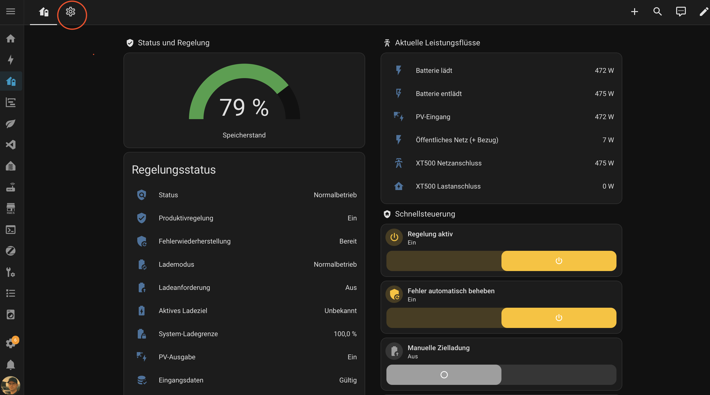

# XT500 Energy Manager

Home-Assistant-Integration zur produktiven Regelung von SunEnergyXT XT500 und
XT500 Pro. Sie übernimmt Nulleinspeisung, normales Laden, manuelle Zielladung,
manuelle und zeitgesteuerte Zyklusladung sowie die Begrenzung der
Wechselrichterleistung.

> [!NOTE]
> Dies ist ein unabhängiges Community-Projekt und keine offizielle
> SunEnergyXT-Integration. Der aktuelle Stand ist als öffentlicher Betatest
> gedacht. Rückmeldungen bitte über
> [GitHub Issues](https://github.com/achim1985/xt500-energy-manager/issues)
> melden.

> [!IMPORTANT]
> **Zuerst muss die originale Integration
> [SunEnergyXT 500 Series](https://github.com/SunEnergyXT/SunEnergyXT-500-Series)
> installiert und vollständig eingerichtet werden.** Der XT500 Energy Manager
> greift auf deren Sensoren und beschreibbare Sollwert-Entitäten zu und ersetzt
> sie nicht.

> [!WARNING]
> Diese Integration schreibt im Produktivbetrieb direkt auf die Sollwerte des
> Speichers. Automationen, Blueprints oder andere Regelungen, die dieselben
> Entitäten verändern, müssen vorher deaktiviert werden. Zwei gleichzeitig
> aktive Regler können sich gegenseitig überschreiben.

## Inhalt

- [Voraussetzungen](#voraussetzungen)
- [1. SunEnergyXT 500 Series installieren](#1-sunenergyxt-500-series-installieren)
- [2. XT500 Energy Manager installieren](#2-xt500-energy-manager-installieren)
- [3. Integration einrichten](#3-integration-einrichten)
- [4. Dashboard-Strategie einrichten](#4-dashboard-strategie-einrichten)
- [Bedienung und Lademodi](#bedienung-und-lademodi)
- [Dynamischer Stromtarif](#dynamischer-stromtarif)
- [Sicherheitsverhalten](#sicherheitsverhalten)
- [Aktualisieren](#aktualisieren)
- [Fehlerbehebung](#fehlerbehebung)

## Voraussetzungen

- Home Assistant mit Zugriff auf das lokale Netz des XT500
- ein SunEnergyXT XT500 oder XT500 Pro
- die eingerichtete Originalintegration **SunEnergyXT 500 Series**
- ein Leistungssensor am öffentlichen Netzanschlusspunkt, zum Beispiel von
  einem Shelly Pro 3EM
- für die komfortable Dashboard-Erstellung über den Community-Dialog:
  Home Assistant 2026.5 oder neuer

Die Integration wurde mit Home Assistant 2026.7 und der SunEnergyXT-Integration
1.1.3 getestet.

## 1. SunEnergyXT 500 Series installieren

### Installation über HACS

1. In Home Assistant **HACS** öffnen.
2. Oben rechts das Drei-Punkte-Menü öffnen.
3. **Benutzerdefinierte Repositories** auswählen.
4. Als Repository eintragen:

   ```text
   https://github.com/SunEnergyXT/SunEnergyXT-500-Series
   ```

5. Als Typ **Integration** auswählen und das Repository hinzufügen.
6. In HACS nach **SunEnergyXT 500 Series** suchen.
7. Die Integration herunterladen.
8. Home Assistant neu starten.

### SunEnergyXT einrichten

1. **Einstellungen → Geräte & Dienste** öffnen.
2. **Integration hinzufügen** auswählen.
3. Nach **SunEnergyXT 500 Series** suchen.
4. Das automatisch erkannte Gerät bestätigen oder die IP-Adresse des XT500
   manuell eintragen.
5. Prüfen, ob anschließend mindestens folgende Entitäten vorhanden sind:

   - System-Speicherlevel (`SC`)
   - PV-Gesamteingangsleistung (`PV`)
   - Systemleistung am Netzanschluss (`GP`)
   - Systemleistung am Lastanschluss (`LP`)
   - Sollwert Leistung Netzanschluss (`GS`)
   - Sollwert maximale Wechselrichterleistung (`IS`)
   - System-Ladegrenze (`SA`)
   - System-Entladegrenze (`SI`)
   - Entlade-SOC-Hysterese (`SI1`, ab SunEnergyXT 1.1.3)
   - Lade-SOC-Hysterese (`SA1`, ab SunEnergyXT 1.1.3)
   - Systemlastanschluss-Entladegrenze
   - System-Batterieleistung (`BP`, mit aktueller SunEnergyXT-Version)
   - Gesamteingangs- und Gesamtausgangsleistung des Systems (Rückfalllösung
     für ältere SunEnergyXT-Versionen ohne `BP`)

   Ab SunEnergyXT 1.1.2 stehen zusätzlich folgende Tagesenergien zur Verfügung:

   - heutige PV-Erzeugung (`PD`)
   - heutige Netzladung (`GD1`)
   - heutige Netzeinspeisung (`GD2`)
   - heutige Off-Grid-Ausgabe (`LD`)

Erst wenn die für die Regelung zuerst genannten Entitäten verfügbar und nicht
`unavailable` sind, mit dem XT500 Energy Manager fortfahren. Die vier
Tagesenergien sind reine optionale Dashboard-Werte.

Ab SunEnergyXT 1.1.3 lässt sich unter **Einstellungen → Geräte & Dienste →
SunEnergyXT 500 Series → Konfigurieren** das Geräte-Abfrageintervall von 3 bis
60 Sekunden einstellen. Der XT500 Energy Manager erkennt diesen Wert und passt
seine Kommunikations- und Wiederherstellungsfristen daran an. Für eine schnelle
Nulleinspeiseregelung werden weiterhin 3 Sekunden empfohlen; längere Intervalle
reduzieren die Geräteabfragen, verlangsamen aber Messwerte und Regelreaktionen.

`SI1` und `SA1` haben geräteseitig jeweils den Standardwert 5 %. Werden eigene
Werte nur testweise verwendet, beide anschließend wieder auf 5 % stellen. Die
im Energy Manager angezeigte Entlade-Hysterese schreibt ab SunEnergyXT 1.1.3
direkt auf `SI1`; `SA1` erscheint zusätzlich als Lade-Hysterese im Dashboard.

## 2. XT500 Energy Manager installieren

### Installation über HACS (empfohlen)

1. In Home Assistant **HACS** öffnen.
2. Oben rechts das Drei-Punkte-Menü öffnen.
3. **Benutzerdefinierte Repositories** auswählen.
4. Als Repository eintragen:

   ```text
   https://github.com/achim1985/xt500-energy-manager
   ```

5. Als Typ **Integration** auswählen und das Repository hinzufügen.
6. In HACS nach **XT500 Energy Manager** suchen.
7. Die aktuelle Version herunterladen.
8. Home Assistant neu starten.
9. **Einstellungen → Geräte & Dienste → Integration hinzufügen** öffnen.
10. Nach **XT500 Energy Manager** suchen und die Integration auswählen.

### Manuelle Installation

1. Das aktuelle
   [GitHub-Release](https://github.com/achim1985/xt500-energy-manager/releases)
   öffnen.
2. Unter **Assets** den Quellcode als ZIP herunterladen.
3. Das ZIP-Archiv entpacken.
4. Den enthaltenen Ordner

   ```text
   custom_components/xt500_energy_manager
   ```

   in das Home-Assistant-Konfigurationsverzeichnis kopieren, sodass am Ende
   exakt diese Struktur vorhanden ist:

   ```text
   /config
   └── custom_components
       └── xt500_energy_manager
           ├── __init__.py
           ├── manifest.json
           ├── config_flow.py
           ├── frontend
           │   └── xt500-energy-dashboard-strategy.js
           └── ...
   ```

   Häufiger Fehler: Es darf kein zusätzlicher Ordner wie
   `xt500-energy-manager-main` zwischen `custom_components` und
   `xt500_energy_manager` liegen.

5. Home Assistant neu starten.
6. **Einstellungen → Geräte & Dienste → Integration hinzufügen** öffnen.
7. Nach **XT500 Energy Manager** suchen und die Integration auswählen.

## 3. Integration einrichten

Im ersten Dialog stehen zwei Wege zur Auswahl:

1. **Automatisch über das XT500-Gerät einrichten (empfohlen)**
2. **Entitäten manuell auswählen (Expertenmodus)**

Bei der automatischen Einrichtung wird nur das Gerät der zuvor installierten
**SunEnergyXT 500 Series** Integration ausgewählt. Der Energiemanager erkennt
die originalen XT500-Entitäten anhand ihrer stabilen Gerätekennungen
automatisch. Umbenannte Anzeigenamen sind daher kein Problem.

Die vier Tagesenergie-Sensoren aus SunEnergyXT 1.1.2 werden ebenfalls
automatisch erkannt, sofern sie am ausgewählten Gerät vorhanden sind. Sie sind
für die Regelung nicht erforderlich und werden deshalb im Expertenmodus nicht
zusätzlich abgefragt. Fehlt einer dieser optionalen Sensoren, bleibt nur die
entsprechende Kachel unter **Energie heute** ausgeblendet.

Manuell bleiben:

- die **Gesamtleistung am öffentlichen Netzanschlusspunkt**
- die dazu passende **Vorzeichenrichtung**
- optional die **PV-Leistung über AC** und deren Vorzeichenrichtung

Der AC-PV-Sensor ist nicht sicherheitskritisch. Die Integration rekonstruiert
den nutzbaren AC-Überschuss aus öffentlichem Stromzähler und XT500-Netzport.
Der optionale Sensor verbessert Anzeige und Diagnose; bei seinem Ausfall läuft
die Regelung weiter. Der öffentliche Stromzähler bleibt maßgeblich.

Die automatische Erkennung prüft, ob alle für die Regelung notwendigen
Original-Entitäten am ausgewählten XT500 vorhanden sind. Falls die
SunEnergyXT-Integration einzelne Werte nicht bereitstellt oder Werte mehrfach
gefunden werden, zeigt der Dialog einen konkreten Fehler und verweist auf den
Expertenmodus.

Der Expertenmodus bietet weiterhin die vollständige manuelle Zuordnung:

| Feld | Benötigte Entität |
| --- | --- |
| Speicherstand (SOC) | SunEnergyXT **System-Speicherlevel** (`SC`) |
| PV direkt am XT500 | SunEnergyXT **PV-Gesamteingangsleistung** (`PV`) |
| PV-Leistung über AC (optional) | Leistungssensor eines externen AC-PV-Wechselrichters; Erzeugung darf positiv oder negativ gemeldet werden |
| Leistung am öffentlichen Netzanschlusspunkt | Leistung des Hauszählers, zum Beispiel Gesamtwirkleistung eines Shelly Pro 3EM |
| XT500-Systemleistung am Netzanschluss | SunEnergyXT **Systemleistung am Netzanschluss** (`GP`) |
| XT500-Systemleistung am Lastanschluss | SunEnergyXT **Systemleistung am Lastanschluss** (`LP`) |
| Sollwert Leistung Netzanschluss | SunEnergyXT **Sollwert Leistung Netzanschluss** (`GS`) |
| Sollwert max. Wechselrichterleistung | SunEnergyXT **Sollwert max. Wechselrichterleistung** (`IS`) |
| System-Ladegrenze | SunEnergyXT **System-Ladegrenze** (`SA`); im Normalbetrieb synchronisiert der Energiemanager Änderungen in beide Richtungen |
| Entladegrenze | SunEnergyXT **System-Entladegrenze** (`SI`); der Energiemanager zeigt und ändert direkt denselben Gerätewert |
| Systemlastanschluss-Entladegrenze | SunEnergyXT **Systemlastanschluss-Entladegrenze**; wird im Dashboard direkt am Gerät eingestellt |
| Batterie-Lade-/Entladeleistung | SunEnergyXT **System-Batterieleistung** (`BP`, positiv lädt, negativ entlädt); Gesamt-Ein-/Ausgang dienen bei älteren Versionen als Rückfalllösung |

Der vorzeichenbehaftete Wert `BP` wird bevorzugt in zwei gegenseitig
ausschließende Werte aufgeteilt. Fehlt `BP`, berechnet der Energiemanager sie
aus Gesamt-Eingang und Gesamt-Ausgang. Bei 200 W Eingang und 300 W Ausgang
zeigt das Dashboard daher `0 W` Laden und `100 W` tatsächliches Entladen.

### Öffentlichen Netzsensor richtig auswählen

Der öffentliche Netzsensor muss den Leistungsfluss des **gesamten Hauses am
Netzübergabepunkt** messen. Die PV-Leistung oder die XT500-Netzanschlussleistung
ist dafür nicht geeignet.

Anschließend die passende Vorzeichenrichtung auswählen:

- **Netzbezug ist positiv:** Der Sensor zeigt beim Strombezug zum Beispiel
  `+500 W` und bei Einspeisung `-500 W`.
- **Netzeinspeisung ist positiv:** Der Sensor zeigt bei Einspeisung
  `+500 W` und beim Strombezug `-500 W`.

Die Richtung vor dem Aktivieren der Regelung anhand eines aktuellen
Messwertes prüfen.

### Vor dem ersten Einschalten

1. Alte Nulleinspeisungs-Automationen oder Blueprints deaktivieren.
2. Prüfen, dass kein anderer Regler `GS`, `IS` oder `SA` beschreibt.
3. Für einen normalen XT500 die **Maximale Leistung ins Hausnetz** üblicherweise
   auf maximal `800 W` setzen. Dieser Wert begrenzt ausschließlich die positive
   Abgabe und nicht die Netzladung.
4. Die **Gewünschte Ladeleistung** separat festlegen. Beim XT500 Pro sind
   abhängig vom Gerätebereich bis zu `2400 W` Netzladung möglich.
5. Erst danach **Regelung aktiv** einschalten.

## 4. Dashboard-Strategie einrichten

Die Strategie erzeugt in der ausführlichen Standarddarstellung sechs Ansichten:

- **Speicher:** Status, Speicherstand, Leistungsflüsse, heutige Energiewerte
  und Schnellsteuerung für Regelung, manuelle Zielladung und Zyklusladung
- **Energie:** Energiefluss, Netzbilanz, Eigenverbrauch, Autarkie sowie
  Quellen- und Kostentabelle
- **Verlauf:** Hausverbrauch und PV-Erzeugung im gewählten Zeitraum
- **Verbraucher:** Energie-Sankey, größte Verbraucher und detaillierter
  Geräteverbrauch
- **Live:** aktueller Gesamtverbrauch, Akkustand, Leistung nach Quelle und
  momentaner Leistungsfluss als Sankey-Diagramm
- **Einstellungen:** Anleitung, manuelle Zielladung, Zyklusüberwachung,
  tägliche Prüfzeit, manueller Zyklusstart, Normalbetrieb und erweiterte
  Regelparameter

Die vier Energieseiten verwenden ausschließlich die in Home Assistant unter
**Energie** konfigurierten Quellen und Statistikdaten. Ihre Datumsauswahl und
der Vergleichszeitraum sind über die drei historischen Reiter synchron. Die
Live-Seite zeigt aktuelle Leistungsdaten unabhängig vom gewählten Zeitraum.
Im Strategy-Editor lassen sie sich alternativ zu einer kompakten Seite
zusammenfassen oder vollständig ausblenden.

### Einstellungsansicht nicht übersehen

Oben im automatisch erzeugten Dashboard gibt es mehrere Reiter. Das Haussymbol
öffnet die Speicherübersicht. Über das **Zahnradsymbol** ganz rechts wird die
vollständige Einstellungsansicht geöffnet. Je nach Bildschirmbreite werden
diese Reiter nur als Symbole angezeigt und können deshalb leicht übersehen
werden.



> [!TIP]
> Auf das markierte Zahnradsymbol klicken, um Ladeziele, Zyklusladung,
> Normalbetrieb und die erweiterten Regelparameter einzustellen.

Sie verwendet ausschließlich standardmäßig mit Home Assistant ausgelieferte
Karten.

Zusätzlich lassen sich über einen grafischen Strategy-Editor einzelne
Ansichten aus anderen, in Home Assistant gespeicherten Dashboards als echte
Reiter in die obere Leiste aufnehmen. Die Quellansicht bleibt dabei die
führende Konfiguration: Änderungen an ihr erscheinen nach einem vollständigen
Neuladen auch im Energiemanager-Dashboard.

### Schritt 1: JavaScript-Ressource registrieren

1. **Einstellungen → Dashboards** öffnen.
2. Oben rechts das Drei-Punkte-Menü öffnen.
3. **Ressourcen** auswählen.
4. **Ressource hinzufügen** auswählen.
5. Als URL exakt eintragen:

   ```text
   /xt500_energy_manager/xt500-energy-dashboard-strategy.js?v=1.10.7
   ```

6. Als Ressourcentyp **JavaScript-Modul** auswählen.
7. Speichern.
8. Im Drei-Punkte-Menü **Ressourcen neu laden** wählen. Falls dieser Eintrag
   nicht angeboten wird, Home Assistant im Browser vollständig neu laden.

### Schritt 2A: Dashboard über „Community-Dashboards“ erstellen

Dieser Weg steht ab Home Assistant 2026.5 zur Verfügung.

1. Wieder **Einstellungen → Dashboards** öffnen.
2. **Dashboard hinzufügen** auswählen.
3. Im Abschnitt **Community-Dashboards** auf
   **XT500 Energiemanager** klicken.
4. Die vorgeschlagenen Werte prüfen:

   - Titel: `XT500 Energiemanager`
   - Symbol: `mdi:home-battery`
   - URL: zum Beispiel `xt500-energiemanager`
   - In der Seitenleiste anzeigen: nach Wunsch aktivieren

5. Dashboard erstellen.
6. Das neue Dashboard öffnen. Die Ansichten **Speicher**, **Energie**,
   **Verlauf**, **Verbraucher**, **Live** und **Einstellungen** werden automatisch
   erzeugt.

### Schritt 2B: Manuelle Erstellung über die Rohkonfiguration

Dieser Weg funktioniert auch, wenn das Community-Dashboard nicht im
Auswahldialog erscheint.

1. **Einstellungen → Dashboards → Dashboard hinzufügen** öffnen.
2. Ein neues leeres Dashboard erstellen, zum Beispiel mit:

   - Titel: `XT500 Energiemanager`
   - Symbol: `mdi:home-battery`
   - URL: `xt500-energiemanager`

3. Das neue Dashboard öffnen.
4. Oben rechts auf den Stift **Dashboard bearbeiten** klicken.
5. Das Drei-Punkte-Menü öffnen.
6. **Rohkonfigurationseditor** auswählen.
7. Den gesamten vorhandenen Inhalt durch Folgendes ersetzen:

   ```yaml
   strategy:
     type: custom:xt500-energy-manager
   ```

8. Speichern und das Dashboard vollständig neu laden.

Die Karten und Ansichten dürfen bei einem Strategie-Dashboard nicht zusätzlich
manuell in die Rohkonfiguration kopiert werden. Sie werden bei jedem Öffnen aus
den vorhandenen XT500-Energy-Manager-Entitäten erzeugt.

### Blöcke anordnen und ausblenden

1. Unter **Einstellungen → Dashboards** beim
   **XT500 Energiemanager** die Dashboard-Einstellungen öffnen.
2. Im grafischen Strategy-Editor den Bereich
   **Aufbau der Energiemanager-Seiten** öffnen.
3. Für **Speicher** oder **Einstellungen**:

   - mit `↑` und `↓` einen Block verschieben
   - den Haken entfernen, um einen Block auszublenden
   - **Standard wiederherstellen** wählen, um alle Blöcke wieder einzublenden
     und die ursprüngliche Reihenfolge herzustellen

4. Speichern und das Dashboard vollständig neu laden.

Die Reihenfolge wird auf Smartphones von oben nach unten verwendet. Auf
breiten Bildschirmen verteilt Home Assistant dieselbe Reihenfolge automatisch
auf bis zu drei Spalten. Speicherstand, Regelungsstatus, Sollwerte,
Zyklusladung, Leistungsflüsse, **Energie heute** und Schnellsteuerung bleiben
dabei eigenständige Blöcke.

### Energieseiten auswählen

1. Unter **Einstellungen → Dashboards** beim
   **XT500 Energiemanager** die Dashboard-Einstellungen öffnen.
2. Im Strategy-Editor unter **Energie-Dashboard** die gewünschte Darstellung
   wählen:

   - **Ausführlich – vier Reiter:** Energie, Verlauf, Verbraucher und Live
   - **Kompakt – ein Reiter:** die wichtigsten Karten auf einer Seite
   - **Nicht anzeigen:** keine zusätzlichen Energieseiten

3. Speichern und das Dashboard vollständig neu laden.

Die Datumsauswahl, frei gewählte Zeiträume und der Vergleich mit dem vorherigen
Zeitraum bleiben in der ausführlichen Darstellung über die drei historischen
Reiter synchron. **Live** zeigt den aktuellen Gesamtverbrauch, den Akkustand,
den Leistungsverlauf des Tages und den momentanen Leistungsfluss. Voraussetzung
sind unter **Energie** eingerichtete Netz-, PV-, Speicher- oder
Verbraucherquellen einschließlich der jeweiligen Leistungssensoren. Fehlende
Quellen erzeugt der Energiemanager nicht künstlich.

### Ansichten anderer Dashboards ergänzen

1. Das XT500-Energiemanager-Dashboard öffnen.
2. Oben rechts **Dashboard bearbeiten** auswählen.
3. Die Konfiguration der Dashboard-Strategie öffnen.
4. Unter **Zusätzliche Dashboard-Ansichten** auf
   **Ansicht hinzufügen** klicken.
5. Das Quell-Dashboard und anschließend die gewünschte Quell-Ansicht
   auswählen.
6. Optional einen kürzeren Titel und ein anderes `mdi:`-Symbol für den neuen
   Reiter eintragen.
7. Die Sichtbarkeit wählen:

   - **Für alle berechtigten Benutzer:** Vorhandene Benutzerbeschränkungen der
     Quellansicht bleiben unverändert erhalten.
   - **Nur für mich:** Die Ansicht wird zusätzlich auf das Benutzerkonto
     beschränkt, das diese Einstellung speichert.

8. Speichern und das Dashboard vollständig neu laden.

Die eingebundene Ansicht erscheint als normaler Reiter nach **Speicher** und vor
den automatisch erzeugten Energieseiten. **Einstellungen** bleibt dabei immer
der ganz rechte Reiter.
Es wird keine unabhängige Kopie angelegt. Dadurch bleiben spätere Änderungen an
der ursprünglichen Ansicht wirksam.

> [!NOTE]
> Einbindbar sind einzelne, fest konfigurierte Ansichten aus Dashboards im
> Speichermodus. Ein anderes XT500-Energiemanager-Strategie-Dashboard oder eine
> Ansicht mit eigener dynamischer Strategie wird zum Schutz vor verschachtelten
> Strategien nicht angeboten.

## Bedienung und Lademodi

### Normalbetrieb

Der Speicher gleicht den Hausverbrauch aus und hält das eingestellte Netzziel
ein. Das **Ladelimit im Normalbetrieb** und die originale
SunEnergyXT-System-Ladegrenze (`SA`) werden in beide Richtungen synchronisiert.
Der Wert kann daher an beiden Stellen geändert werden.

Während einer manuellen Zielladung, Zyklusladung oder Tarifladung verwendet der
Energiemanager `SA` vorübergehend als aktive Ladegrenze. Das normale Ladelimit
bleibt dabei separat erhalten und wird nach Zielerreichung oder Abbruch wieder
auf das Gerät geschrieben. Während einer solchen Ladung sollte das normale
Ladelimit deshalb im Energiemanager geändert werden.

Die **Entladegrenze** ist kein getrennt gespeicherter Energiemanager-Wert:
Sie zeigt und verändert direkt die originale System-Entladegrenze (`SI`) des
XT500. Änderungen über SunEnergyXT und über das Energiemanager-Dashboard
bleiben dadurch identisch. Ab SunEnergyXT 1.1.3 wird auch die
Wiederfreigabe-Hysterese mit der Geräteentität `SI1` synchronisiert.

Hat der Speicher die Entladegrenze bereits erreicht, bleibt die Entladung bis
zur Entladegrenze plus Wiederfreigabe-Hysterese gesperrt. Der Knopf
**Entladesperre einmalig freigeben** erlaubt innerhalb dieses Bereichs eine
einmalige weitere Entladung. Die reguläre Grenze bleibt im Energiemanager
sichtbar. Technisch wird nur die originale XT500-System-Entladegrenze
vorübergehend abgesenkt und mit Rücklesekontrolle wiederhergestellt, sobald die
reguläre Grenze erneut erreicht wird. Beim Abschalten des Energiemanagers oder
nach einem Neustart wird die temporäre Freigabe ebenfalls sicher beendet.

Die Einstellung **PV für Regelung berücksichtigen** bietet drei eindeutige
Auswahlen: **Hybrid (empfohlen)** verwendet XT500-PV und AC-PV-Überschuss,
**Nur XT500-PV** ausschließlich die direkt angeschlossenen Module und
**Nur externe AC-PV** ausschließlich den am öffentlichen Netzanschluss
erkannten AC-PV-Überschuss.

### PV-Einspeisung bei vollem Akku

Der Schalter **PV-Überschuss bei vollem Akku einspeisen** ist standardmäßig aus.
Ist er eingeschaltet und der Speicher hat die aktuell wirksame
SunEnergyXT-System-Ladegrenze erreicht, folgt der XT500 bei direkt
angeschlossener PV der PV-Erzeugung, sofern diese den Verbrauch decken kann:
Der Energiemanager setzt den
Netzanschluss-Sollwert (`GS`) auf 0 W und öffnet die Wechselrichter-Obergrenze
(`IS`) bis zur erlaubten Leistung. Nach Versorgung von Haus und Lastanschluss
kann der verbleibende PV-Überschuss ins öffentliche Netz fließen. Die
eingestellte **Maximale Leistung ins Hausnetz**, die Wechselrichtergrenze und
die Gerätegrenzen bleiben maßgeblich; „komplett“ bedeutet daher nur den
technisch und eingestellten Grenzen entsprechenden Anteil.

Reicht die PV-Leistung nicht für den Verbrauch, bleibt beziehungsweise wird
wieder der gewählte Grundmodus aktiv. Im Normalbetrieb unterstützt der Akku
den Hausverbrauch weiter, sofern Mindest-SOC und Entladefreigabe dies erlauben.
Im PV-Überschuss-Grundmodus gilt weiterhin dessen bisherige Entladebegrenzung.
Die Freigabe berücksichtigt die verfügbare DC-PV nach dem Lastanschluss sowie
die tatsächliche XT500-Ausgabe und öffentliche Netzleistung. Bei mehr als
30 W gemessener Versorgungslücke oder Akkuunterstützung ohne entsprechenden
Netzüberschuss wird der Bypass nicht freigegeben. So führen auch
Umwandlungsverluste nicht zu einer dauerhaften Versorgungslücke.

`IS` ist eine Obergrenze, keine Anforderung, diese Leistung aus dem Akku
abzugeben. Im Bypass wird sie deshalb nicht auf die aktuelle PV-Messung
begrenzt: Diese Messung kann bereits durch eine vorherige Obergrenze
abgeregelt sein. Hausverbrauch und Umwandlungsverluste sind bei einem Vergleich
von DC-PV-Eingang und tatsächlicher Netzeinspeisung zu berücksichtigen.

Der Bypass arbeitet im Normalbetrieb und im PV-Überschuss-Grundmodus, sofern
**XT500-PV** in der PV-Berücksichtigung enthalten und die DC-PV-Ausgabe
freigegeben ist. Eine manuelle, zyklische oder Tarifladung hat Vorrang. Bei
einem neuen Ladeauftrag, Abschalten des Schalters oder fehlender PV-Freigabe
kehrt die bisherige Regelung zurück. Nach Erreichen der Ladegrenze hält ein
1-%-SOC-Band den Zustand bei kleinen Messwertschwankungen stabil. Unterhalb
dieses Bandes wird wieder normal geregelt. Gemessene Akkuentladung verringert
die Wechselrichter-Obergrenze, damit keine Batterieenergie absichtlich
eingespeist wird. Ungültige Pflichtmesswerte stoppen Schreibvorgänge wie bisher.

Der Schalter bezieht sich auf die **System-Ladegrenze**, nicht auf die
gesonderte Bestätigung einer 100-%-Zyklusladung. Externe AC-PV speist über
ihren eigenen Wechselrichter ein; der XT500-Bypass steuert nur seine direkt
angeschlossene DC-PV. Nach dem Einschalten bei vollem Speicher die tatsächliche
Netzleistung und Batterieleistung prüfen. Die Anzeige **Akku voll –
PV-Einspeisung** bestätigt den aktiven Regelpfad, nicht eine am Netz gemessene
Einspeisemenge.

Für einen kurzen Test kann die **System-Ladegrenze** vorübergehend auf einen
erlaubten Wert höchstens in Höhe des aktuellen SOC gesetzt werden. Das Gerät
erlaubt üblicherweise nur 70–100 %. Vorher die ursprüngliche Ladegrenze
notieren, aktive Ladeaufträge beenden und DC-PV-Erzeugung oberhalb des Haus-
und Lastverbrauchs mit Reserve für Umwandlungsverluste abwarten. Netz- und
Batterieleistung beobachten und danach die ursprüngliche
Ladegrenze wieder einstellen. Bei einem Statusfehler aus Version 1.10.5 den
PV-Bypass ausschalten und auf mindestens 1.10.7 aktualisieren; der Fehler
`full_battery_pv_bypass ... not in the list of options` ist dort behoben.

Die Prüfung vom 30.09.2026 ist dokumentiert: [Vergleich der Versorgungslücke
in 1.10.6](docs/testing/2026-09-30-full-battery-pv-bypass.md) und
[Gerätetest sowie Einspeisung und Rückwechsel mit 1.10.7](docs/testing/2026-09-30-original-integration-pv-bypass.md).
Die Messungen zeigen PV-Ausgabe ohne gemessene Akkuentladung und die Rückkehr
zur Akkuunterstützung bei fehlender PV. Langfristige Stabilität über wechselnde
Wetter- und Lastsituationen ist damit noch nicht nachgewiesen.

### PV-Überschuss

DC-PV und rekonstruierter AC-PV-Überschuss werden genutzt, ohne absichtlich
Netzstrom zu beziehen. Nicht benötigte direkt angeschlossene PV kann im Akku
bleiben. Reicht PV nicht aus, wartet der Modus auch über mehrere Tage.

Die Regelung verwendet dabei zwei reale Rückmeldungen: **Batterie entlädt
tatsächlich** und die Einspeisung am öffentlichen Netzanschluss. Jede gemessene
Akkuentladung wird vollständig gegengeregelt; für sie gilt keine Totzone. Die
einstellbare **Netzeinspeisungs-Totzone im PV-Überschussmodus** beruhigt nur
kleine Schwankungen am öffentlichen Netzanschluss. Da Akkuentladung und
Einspeisung häufig denselben Leistungsüberschuss abbilden, wird nur der größere
Fehler verwendet.

**Bevorzugte Akku-Ladeleistung im PV-Überschussmodus** bezeichnet die gewünschte
gemessene Netto-Ladeleistung des Akkus und ist ausschließlich in diesem Modus
wirksam. Es handelt sich nicht um eine feste Ladeanforderung aus dem Netz.
Entlädt der Akku, senkt die Regelung Netzanschluss-Sollwert (`GS`) und
Wechselrichter-Obergrenze (`IS`) um die vollständige Entladeleistung plus den
noch fehlenden Ladeanteil. Im erreichten Ladebereich hält sie den aktuellen
Sollwert und erhöht ihn erst wieder mit zusätzlicher Ladereserve. Damit wird
Laden gegenüber Entladen bevorzugt und ein Pendeln an der 0-W-Grenze vermieden.
Standardwerte sind 50 W bevorzugte Akkuladung und 20 W Netzeinspeisungs-Totzone;
für schnelle Rückmeldung sollte das SunEnergyXT-Abfrageintervall auf 3 Sekunden
stehen.

### PV-Vorrang

Das Ladeziel wird ausschließlich mit DC- und AC-PV verfolgt. Direkt am XT500
angeschlossene PV bleibt bevorzugt für den Akku; AC-PV-Überschuss wird
aufgenommen. Die Batterieentladung wird zurückgehalten und es wird kein
absichtlicher Netzbezug erzeugt.

### Netzladung

Die eingestellte Ladeleistung bezeichnet den gewünschten Anteil aus dem
öffentlichen Netz. Vorhandener AC-PV-Überschuss kann zusätzlich laden. Beispiel:
`1200 W` Netzanteil plus `600 W` AC-PV ergeben bis zu `1800 W`
Batterieladung, sofern das Gerät dies unterstützt.
Die Einstellung **Maximale Leistung ins Hausnetz** begrenzt diese Ladeleistung
nicht. Der negative Ladesollwert wird nur durch die gewünschte Ladeleistung
und den echten Wertebereich des ausgewählten Gerätes begrenzt.

### PV + Netz

Die eingestellte Ladeleistung ist das Ziel für die gesamte Batterieladung.
DC- und AC-PV tragen dazu bei; nur der fehlende Anteil kommt aus dem Netz.
Beispiel: `1200 W` Ladeziel und `600 W` AC-PV ergeben ungefähr `600 W`
Netzbezug. AC-PV wird dabei nicht doppelt abgezogen.

### Status: ausgewählt, aktiv und tatsächlich genutzt

- **Aktiver Vorgang** zeigt, wer die Sollwerte exklusiv besitzt: Normalbetrieb,
  manuelle Zielladung, manuelle oder automatische Zyklusladung oder Tarifladung.
- **Ausgewählter Lademodus** zeigt die Einstellung; **Aktiver Lademodus** die
  momentan wirksame Strategie. **Zustand des Lademodus** unterscheidet unter
  anderem Laden und Warten auf ausreichende PV.
- **Ausgewählter Kopplungsmodus** zeigt die Vorgabe. **Aktive Kopplung** zeigt
  anhand der Messwerte DC, AC, DC + AC oder keine aktive PV.
- **Aktuelle Ladequelle** unterscheidet PV, Netz, PV + Netz und keine Ladung.

### Dynamischer Stromtarif

Die Integration besitzt eine eigene, zeitlich begrenzte
**Tarif-Ladeanforderung**. Sie ist von manueller Zielladung und Zyklusladung
getrennt und kann von einer beliebigen Home-Assistant-Automation bedient werden.

Die Tarifladung verwendet immer:

- reine **Netzladung**
- ein separates **Ladeziel der Tarifladung**
- eine separate **Netzleistung der Tarifladung**
- eine einstellbare **Gültigkeitsdauer je Tarifanforderung**

Die Priorität lautet:

1. manuelle Zielladung
2. manuelle oder automatische Zyklusladung
3. Tarifladung
4. Grundbetrieb

Eine höher priorisierte Ladung überschreibt die Tarifanforderung nicht
dauerhaft. Ist sie danach noch nicht abgelaufen, darf die Tarifladung bis zu
ihrem eigenen Ziel weiterlaufen. Bei Zielerreichung oder Ablauf kehrt die
Integration automatisch in den Grundbetrieb zurück.

> [!IMPORTANT]
> Bei hohem Strompreis ist kein eigener Entlademodus erforderlich. Im
> Normalbetrieb versorgt der Energiemanager das Haus bereits aus dem Akku,
> solange die Entladegrenze nicht erreicht ist. Die Tarifsteuerung fordert
> keine Batterieeinspeisung in das öffentliche Netz an.

#### Mitgelieferten Preis-Blueprint verwenden

Der mitgelieferte Blueprint arbeitet anbieterunabhängig mit jedem numerischen
Strompreissensor, beispielsweise dem aktuellen Gesamtpreis der offiziellen
Tibber-Integration.

Der Blueprint wird zusammen mit der Integration installiert und nach einem
HACS-Update beim nächsten Home-Assistant-Start automatisch aktualisiert. Unter
**Einstellungen → Automationen & Szenen → Blueprints** erscheint:

**XT500 – Laden bei günstigem Strompreis**

Eigene Änderungen an der installierten Blueprint-Datei werden erkannt und
nicht überschrieben. In diesem Fall protokolliert die Integration eine Warnung
und lässt die angepasste Fassung bestehen.

1. Aus dem Blueprint **XT500 – Laden bei günstigem Strompreis** eine
   Automation erstellen.
2. Folgende Entitäten auswählen:

   - aktuellen Strompreissensor
   - originalen SunEnergyXT-System-Speicherlevel
   - **Tarifladung anfordern**
   - **Ladeziel der Tarifladung**
   - **Netzleistung der Tarifladung**

3. Startpreis, Ausschaltpreis, Ladeziel und Ladeleistung einstellen.

Beispiel:

- unter `0,20 €/kWh`: Tarifladung starten
- von `0,20` bis unter `0,22 €/kWh`: bisherigen Zustand beibehalten
- ab `0,22 €/kWh`: Tarifladung beenden
- bei `unknown`, `unavailable` oder erreichtem SOC: Tarifladung beenden

Der Blueprint prüft den Preis bei jeder Änderung, nach einem
Home-Assistant-Start und alle 15 Minuten. Während eines günstigen Zeitraums
erneuert er die zeitlich begrenzte Anforderung. Die eingestellte Gültigkeitsdauer
sollte deshalb länger als 15 Minuten sein; der Standardwert von 90 Minuten
bietet ausreichend Reserve.

Die Preisgrenzen müssen dieselbe Einheit wie der ausgewählte Sensor verwenden.
Ein Sensor in `ct/kWh` benötigt beispielsweise `20` und `22` statt `0,20` und
`0,22`.

Diese erste Strategie reagiert auf den aktuellen Preis. Sie sucht noch nicht
vorausschauend die günstigsten Zeitfenster von heute oder morgen und
berücksichtigt keine PV-Prognose.

### Zyklusladung

Die Zyklusladung verwendet ihren eigenen **Lademodus** und ihr eigenes
**Vollladeziel**:

- **Automatische Zyklusüberwachung** zählt die Tage seit dem letzten erreichten
  Vollladeziel beziehungsweise seit dem letzten manuellen Zurücksetzen. Der
  eingeschaltete Schalter bedeutet nur, dass überwacht wird – noch nicht, dass
  gerade geladen wird.
- Ist das Intervall abgelaufen, lautet der Zyklusstatus
  **Fällig – wartet auf tägliche Prüfzeit**. Erst zur eingestellten
  **täglichen Prüfzeit** wird die Zyklusladung im ausgewählten Modus gestartet.
- **Zyklusladung jetzt manuell starten** startet sofort, auch wenn das
  Intervall noch nicht abgelaufen ist. Die automatische Überwachung wird
  dadurch nicht umgeschaltet.
- **Zyklustage auf 0 zurücksetzen** beginnt das Intervall ab diesem Zeitpunkt
  neu und beendet eine gegebenenfalls laufende Zyklusladung. Der Reset wird
  nicht als künstlich erreichte Vollladung gespeichert.

Der separate **Zyklusstatus** unterscheidet:

- automatische Überwachung aus
- automatische Überwachung aktiv
- Zyklus fällig und auf Prüfzeit wartend
- manuell gestartete Zyklusladung aktiv
- automatisch gestartete Zyklusladung aktiv
- Zyklusladung angehalten, beispielsweise bei ausgeschalteter Regelung oder
  ungültigen Eingangsdaten

### Verhalten bei erreichtem Ziel

- Die manuelle Zielladung wird beendet.
- Eine manuell oder automatisch gestartete Zyklusladung wird beendet.
- Beim Erreichen des Vollladeziels wird der Zeitpunkt gespeichert und das
  Zyklusintervall beginnt neu. Das gilt auch, wenn der Speicher dieses Ziel im
  Normalbetrieb allein durch PV erreicht.
- Die System-Ladegrenze kehrt zum **Ladelimit im Normalbetrieb** zurück.
- Anschließend arbeitet wieder der gewählte Grundmodus.

## Sicherheitsverhalten

- Nach einem Home-Assistant-Start wartet die Integration, bis Home Assistant
  vollständig läuft und alle Eingangsdaten mindestens fünf Sekunden gültig
  waren.
- Kurzzeitig ungültige Eingangsdaten oder nicht lesbare XT500-Sollwerte starten
  zunächst nur eine Kommunikationspause. Die Regelung fährt automatisch fort,
  sobald alle Werte und frischen Messrückmeldungen 15 Sekunden stabil sind.
- Nach einem Schreibbefehl prüft die Integration eine vorübergehend fehlende
  Sollwert-Rückmeldung jede Sekunde erneut, insgesamt bis zu drei eingestellte
  Geräte-Abfragezyklen. Währenddessen bleiben Schreibvorgänge sofort gesperrt.
- Erst Pausen ab 30 Sekunden erscheinen im Status und erzeugen eine Warnung.
  Kurze, selbstheilende Lücken lassen die Anzeige **Produktivregelung
  betriebsbereit** nicht mehr ein- und ausschalten.
- Bleibt die Kommunikation 90 Sekunden instabil oder schlagen drei
  Schreibversuche trotz weiterhin lesbarer Sollwerte fehl, wird die Regelung
  verriegelt. Ist die
  automatische Fehlerwiederherstellung aktiv, wartet sie zunächst auf stabile
  neue Rückmeldungen, prüft die Verbindung mit einem wirkungslosen Schreibtest
  auf den bereits vorhandenen Wechselrichter-Sollwert und gibt erst nach
  weiteren Messrückmeldungen wieder frei.
- Es gibt höchstens drei automatische Versuche mit wachsender Wartezeit.
  Danach bleibt die Regelung verriegelt, bis der Hauptschalter aus- und wieder
  eingeschaltet wird.
- Kleine, mittlere und große Regelabweichungen verwenden unterschiedliche
  Zeitabstände und maximale Sollwertänderungen.
- Nach jedem Schreibvorgang wartet die Integration auf neue Messwerte.
- Bei sehr geringer PV-Leistung setzt die Niedrig-PV-Sperre die Ausgabe auf
  `0 W` und gibt sie erst nach der eingestellten Startleistung und Wartezeit
  wieder frei.

### Regelung sicher ausschalten

Beim Ausschalten von **Regelung aktiv** beendet der Energiemanager zuerst alle
laufenden Schreibvorgänge. Anschließend setzt er den Netzanschluss-Sollwert auf
`0 W`, die Wechselrichter-Obergrenze auf den kleinsten vom Gerät erlaubten Wert
und stellt eine vorübergehend erhöhte System-Ladegrenze auf das normale
Ladelimit zurück. Der Schalter wird erst als ausgeschaltet bestätigt, nachdem
die Gerätewerte zurückgelesen wurden. Erlaubt die SunEnergyXT-Entität keine
`0 W`, wird ihr technischer Minimalwert verwendet, beispielsweise `1 W`.

Kann das Gerät die sicheren Abschaltwerte nicht bestätigen, bleibt der
Energiemanager sichtbar im Fehlerzustand und startet keine andere Regelung. So
wird ein vermeintlich ausgeschalteter Regler mit alten Sollwerten vermieden.

## Aktualisieren

### Aktualisierung über HACS

1. **Regelung aktiv** ausschalten.
2. Das von HACS angebotene Update installieren.
3. Home Assistant neu starten.
4. Die Versionsnummer der Dashboard-Ressource auf die neue Version ändern.
5. **Ressourcen neu laden** oder den Browser vollständig neu laden.
6. Dashboard, Eingangsdaten und Produktivregelung prüfen.
7. Regelung wieder aktivieren.

### Manuelle Aktualisierung

1. **Regelung aktiv** ausschalten.
2. Das neue GitHub-Release als ZIP herunterladen.
3. Den vorhandenen Ordner
   `/config/custom_components/xt500_energy_manager` durch den neuen ersetzen.
4. Die Versionsnummer der Dashboard-Ressource an die neue Version anpassen.
5. Home Assistant neu starten.
6. Dashboard und Eingangsdaten prüfen.
7. Regelung wieder aktivieren.

## Fehlerbehebung

### „XT500 Energy Manager“ erscheint nicht bei den Integrationen

- Verzeichnisstruktur prüfen.
- Sicherstellen, dass `manifest.json` direkt unter
  `/config/custom_components/xt500_energy_manager/` liegt.
- Home Assistant neu starten.
- Unter **Einstellungen → System → Protokolle** nach
  `xt500_energy_manager` suchen.

### Dashboard meldet „Timeout waiting for strategy element“

- Prüfen, ob die Ressource als **JavaScript-Modul** eingetragen ist.
- URL und Versionsnummer prüfen.
- **Ressourcen neu laden** oder einen vollständigen Browser-Neustart
  durchführen.

### Dashboard bleibt leer

- Prüfen, ob die Integration vollständig eingerichtet ist.
- Prüfen, ob ihre Entitäten verfügbar sind.
- Die Rohkonfiguration muss exakt den Eintrag
  `custom:xt500-energy-manager` enthalten.

### Der Block „Energie heute“ fehlt oder ist unvollständig

- SunEnergyXT 500 Series auf Version 1.1.3 oder neuer aktualisieren.
- Prüfen, ob am ausgewählten XT500 die Sensoren `PD`, `GD1`, `GD2` und `LD`
  vorhanden und verfügbar sind.
- Unter **Einstellungen → Geräte & Dienste → XT500 Energy Manager** den
  Eintrag neu laden oder Home Assistant neu starten. Die optionalen Sensoren
  werden bei jedem Laden der Integration erneut automatisch erkannt.
- Im Strategy-Editor prüfen, ob der Block **Energie heute** ausgeblendet wurde.
- Die Dashboard-Ressource auf `?v=1.10.7` setzen und Ressourcen beziehungsweise
  Browser vollständig neu laden.

### Eingangsdaten sind ungültig

- Die Entität **Eingangsdaten gültig** öffnen. In den Attributen stehen unter
  `current_errors` der betroffene Eingang, die konkrete Entität, ihr gelesener
  Zustand und die genaue Ursache.
- Auch wenn sich die Verbindung bereits erholt hat, bleiben die letzten Fehler
  unter `last_errors` mit `last_error_at` und `last_recovered_at` sichtbar.
- Typische Ursachen werden getrennt ausgewiesen: Entität nicht eingerichtet,
  Entität nicht gefunden, `unavailable`, noch kein gültiger Wert, leerer Wert
  oder nichtnumerischer Messwert.
- Unter **Einstellungen → Geräte & Dienste → XT500 Energy Manager →
  Konfigurieren** kann die automatische Geräteerkennung erneut ausgeführt oder
  die vollständige Zuordnung im Expertenmodus geprüft werden.
- Bei einer Supportanfrage die Home-Assistant-Diagnosedaten der Integration
  beifügen. Sie enthalten `input_errors` mit dem aktuellen und dem zuletzt
  beobachteten Eingangsfehler.

## Projektstatus

Bei einem Zyklusziel von 100 % beendet der Energiemanager die Ladung nicht mehr
allein aufgrund des gerundeten SOC. Ab Erreichen von 100 % hält er den Zustand
standardmäßig mindestens zehn Minuten. Gleichzeitig muss die tatsächlich am
Akku gemessene Ladeleistung fünf Minuten durchgehend höchstens 30 W betragen.
Während dieser Phase wird eine aktive Zyklusladung auf 300 W begrenzt. Nach
spätestens 60 Minuten wird sie sicher beendet und als Zeitlimit im Sensor
**Bestätigung der Vollladung** ausgewiesen. Alle Zeiten, die Ladeende-Schwelle
und die Nachladeleistung sind in der Feinabstimmung änderbar. Eine laufende
Bestätigung wird über Neustarts und Integrations-Neuladungen hinweg fortgesetzt.

Die Einstellung **Bevorzugte Akku-Ladeleistung im PV-Überschussmodus** hält
standardmäßig eine kleine gemessene Netto-Ladung von 50 W. Damit wird
Batterieentladung nicht nur nachträglich korrigiert, sondern der Arbeitspunkt
bewusst auf die Ladeseite verschoben.
Auch bei einem kurzen Netzbezug bleibt diese Rückführung aktiv, damit der
Sollwert nicht wieder in die Akkuentladung zurückpendelt. Die Regelung senkt
dabei ausschließlich die XT500-Ausgangsleistung.

Version 1.10.7 baut auf dem für SunEnergyXT 1.1.3 vorbereiteten Stand auf. Rückmeldungen aus
unterschiedlichen XT500- und XT500-Pro-Systemen, Firmwareständen,
PV-Kopplungen und Stromzählern sind weiterhin willkommen.

Bitte bei einem Fehler ein
[GitHub Issue](https://github.com/achim1985/xt500-energy-manager/issues)
mit folgenden Angaben erstellen:

- Home-Assistant-Version
- Version der SunEnergyXT-Integration
- XT500-Modell und Firmware
- verwendeter öffentlicher Leistungssensor und dessen Vorzeichenrichtung
- Statusanzeige des Energiemanagers
- relevante Protokollmeldung ohne Zugangsdaten oder Seriennummern
